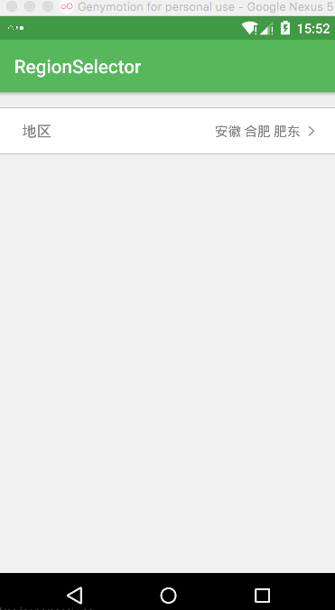

# RegionSelector
地址\地区 选择模块(数据包含中国大部分的省市自治区)

* 使用RecycleView实现省\市\区的布局;
* 数据放在 res/raw/city.json
* 有待完善

[详细介绍](http://www.biglong.cc/android/2016/09/21/RecycleView%E5%AE%9E%E7%8E%B0%E7%9A%84%E5%9C%B0%E5%8C%BA%E9%80%89%E6%8B%A9%E6%A8%A1%E5%9D%97)

[demo下载](files/app-release.apk)

